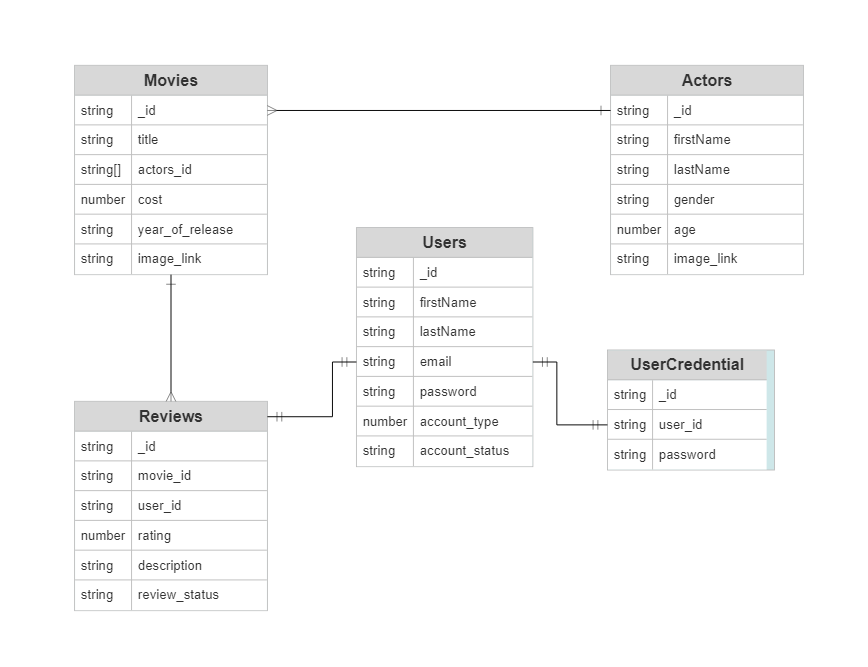
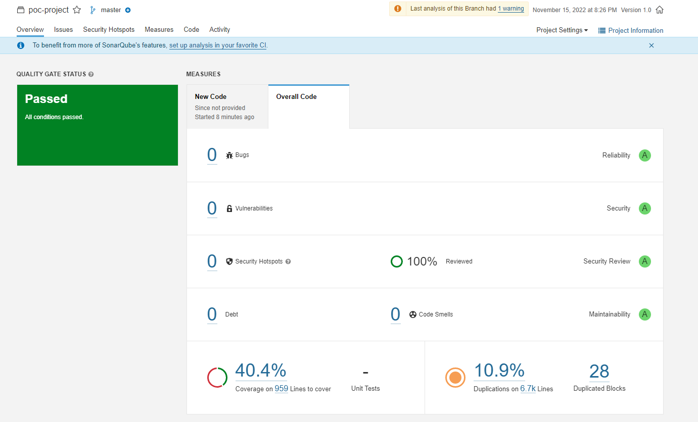
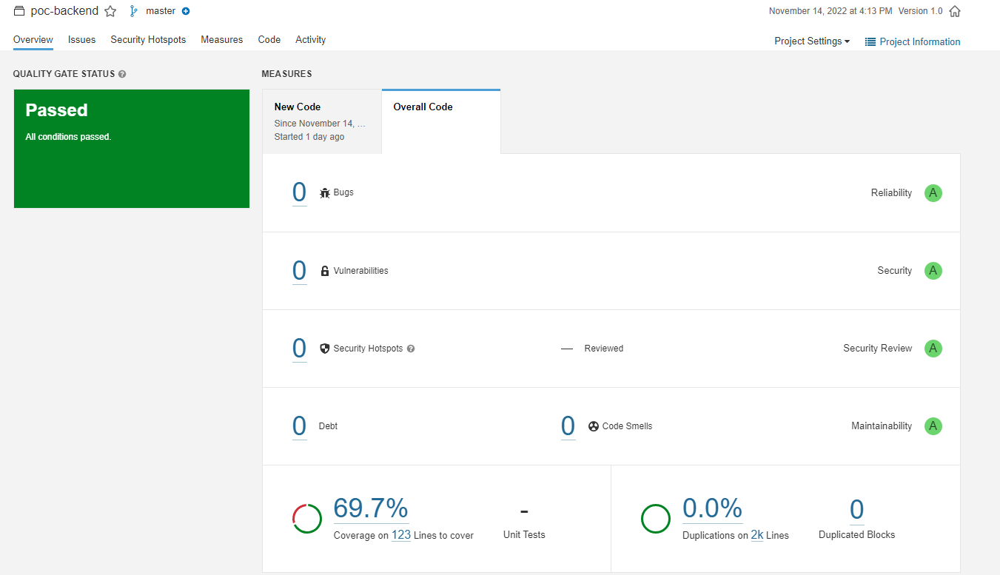

# poc-project

# Description

Digital Streaming System which allows administrators to manage the movie catalogue information about the movies, actors, movie reviews (like Netflix or Amazon Prime) and users management, While normal user can access movies, actors and able to give movie reviews, This application stores details of movies, actors, movie reviews and users in Mongodb nosql database. The application frontend has to be implemented using HTML, SCSS, Javascript, React Typescript, Redux while backend using Loopback and Mongodb nosql Database, for code quality and security it uses Sonarqube, and for unit testing it uses Jest along with React Testing Library.

# Features

- View and search movies together with their actors and reviews(Public)
- Give reviews and ratings to movies(User only)
- Add movies and actors using the dashboard page(Admin only)

# Technologies used:

- React - Typescript
- HTML - SCSS
- Redux Toolkit
- Loopback 4
- MongoDB
- Sonarqube
- React Testing Library + Jest

# Models

This app has the following models:

- User - a model representing the users of the app.
- UserCredential - a model representing the users credentials.
- Movie - a model representing the movies of the app.
- Actor - a model representing the connection between the movies and the actors and a model representing the details of an actor.
- Review - a model representing the reviews of a user to a movie.

# Controllers

- user - controller for login/register user, fetch user info, update user info, delete users
- movies - controller for create, fetch,search, update, delete movies
- actors - controller for create, fetch, search, update, delete actors
- reviews - controller for create, fetch, update, delete reviews

# To Run

- Use `npm install --force` to install dependencies.
- Use `npm start` to see run the application.

# Tests

- Use `npm test` to run test on both FE and BE services.
- Use `npx jest --coverage` to see coverage on both services.

Sonarqube Scanner Results
Front-End:

Back-End:

